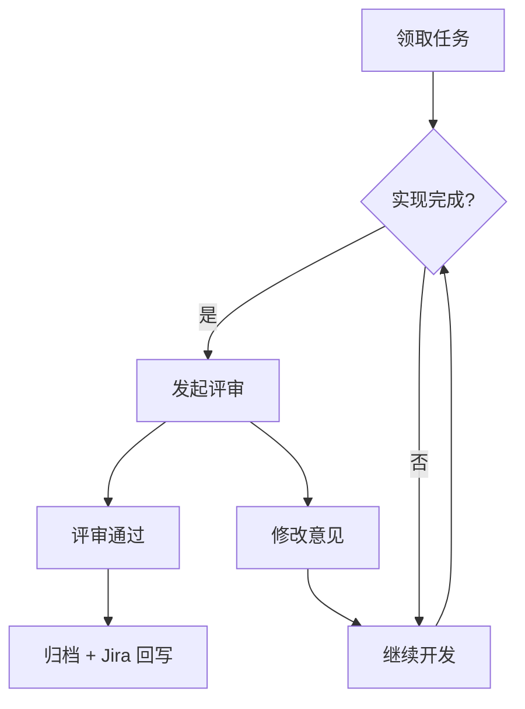

# 团队协作规范

```mermaid
flowchart TD
  A[领取任务] --> B{实现完成?}
  B -- 是 --> C[发起评审]
  B -- 否 --> D[继续开发]
  D --> B
  C --> E[评审通过]
  C --> F[修改意见]
  F --> D
  E --> G[归档 + Jira 回写]
```

<!-- edited-in-panel -->