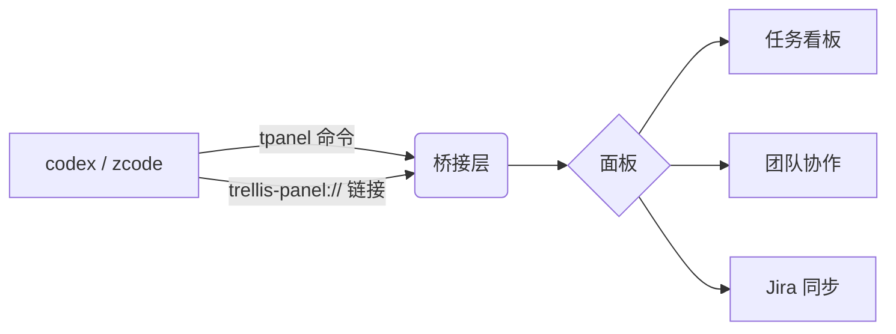
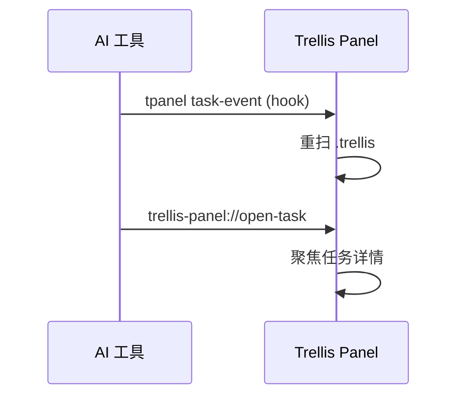

# 看板可视化与交互升级

## 架构

```mermaid
graph LR
  A[codex / zcode] -->|tpanel 命令| B(桥接层)
  A -->|trellis-panel:// 链接| B
  B --> C{面板}
  C --> D[任务看板]
  C --> E[团队协作]
  C --> F[Jira 同步]
```

## 界面流程

```mermaid
sequenceDiagram
  participant AI as AI 工具
  participant P as Trellis Panel
  AI->>P: tpanel task-event (hook)
  P->>P: 重扫 .trellis
  AI->>P: trellis-panel://open-task
  P->>P: 聚焦任务详情
```
